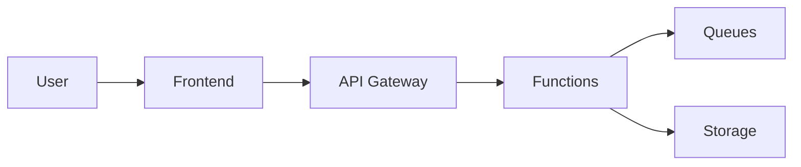

# Architecture

> Keep this diagram in sync with the infrastructure.

```mermaid
flowchart LR
  user[User] --> frontend[Frontend]
  frontend --> apigw[API Gateway]
  apigw --> fn[Functions]
  fn --> queue[Queues]
  fn --> storage[Storage]
```
